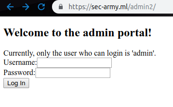

# Admin2
**Category:** crypto <br>
**Point:** 100

> [Link to the Challenge](http://sec-army.ml/admin2/)
> 
> Author: bhavsec

---



Lihat source web, kita fokus pada fungsi `checkLogin`
```javascript
var checkLogin = function () {
  var password = document.getElementById("password").value;
  if (document.getElementById("uname").value != "admin"){
    console.log(uname);
    document.getElementById("message").innerHTML = "Only admin user allowed!";
    return;
  } else {
    var passHash = md5(password);
    if (passHash == "bdc87b9c894da5168059e00ebffb9077"){
      window.location = "./login.php?user=admin&pass=" + password;
    } else {
      document.getElementById("message").innerHTML = "Incorrect Login";
    }
  }
  return;
}
```

Pertama, fungsi mengecek apakah username sama dengan `admin`, jika sama maka fungsi akan mengecek apakah password sama dengan hash dari md5 `bdc87b9c894da5168059e00ebffb9077`.

Username sudah didapat, kita perlu untuk melakukan dekripsi password menggunakan [online decrypt](https://www.md5online.org/md5-decrypt.html). Ternyata berhasil dilakukan hash balik, hal ini karena pesan yang di-hash merupakan pesan yang singkat dan sering digunakan.

hasil hash balik : `password1234`

Selanjutnya kita masukkan pada form dengan username: `admin`, dan password: `password1234`

flag : `secarmy{md5_h4sh_cr4ck3d}`
