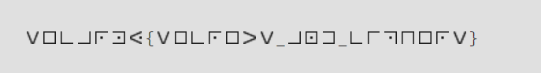

# Alien language
**Category:** crypto  
**Point:** 120

> Fragments of the text have been found in this Alien language. > > Can you decipher it???
> 
> Flag format: secarmy{this_is_my_flag}
> 
> Author: bhavsec

file : [Download](https://ctf.sec.army/files/8bbbccb87752296e92e0bf43e32ac81b/aliens.png)

---

Pada saat pertama lihat, saya teringat pada salah satu sandi pramuka yaitu sandi Kotak. Namun, ketika saya coba terjemahkan menggunakan sandi kotak hasil pesannya tidak terbaca. Setelah membaca beberapa referensi, ternyata simbol-simbol diatas adalah [Masonic Cipher](https://sites.google.com/site/lostsymbolproject/masonic-cipher).

Dengan menggunakan tabel sandi, lakukan penerjemahan secara manual

flag : `secarmy{secrets_and_ciphers}`