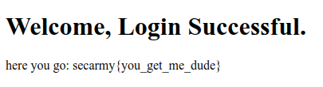

# GET me
**Category:** starters  
**Point:** 50

> Challenge URL- Link here
> 
> Author: bhavsec

link : [Here](http://sec-army.ml/getme)

---

Terdapat sebuah form dengan 1 tombol login yang mengarahkan ke halaman `authenticate.php`. Jika langsung klik tombolnya maka keterangan menunjukkan `"Sorry, you are not authorized"`.

Jika kita lihat lagi pada source halaman, ternyata form dikirim dengan method GET dengan 1 input bernama `val` yang disembunyikan. Kita cukup mengganti value input ini dari **false** menjadi **true** dengan menggunakan _inspect element_.

automate extracting : [script.sh](./script.sh)

flag : `secarmy{you_get_me_dude}`