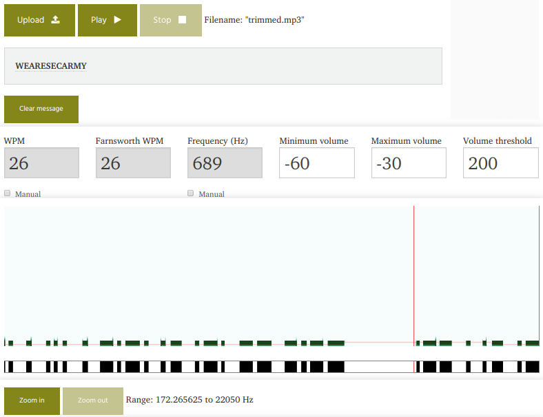

# Listen It Carefully
**Category:** misc  
**Point:** 100

> This is my favourite ringtone.
>
> Format: secarmy{this_is_my_flag}
>
> Author: bhavsec

file : [Download](https://ctf.sec.army/files/4d4915855a8b84cb83e7f15e2a27cc9b/listen_it_carefully.mp3)

---

Kita diberikan 1 file `.mp3` suara nada dering nokia jadul. Namun di tengah suara terdapat bunyi _beep beep_ yang menandakan bahwa itu adalah kode morse.

Pertama, saya coba trim/crop suara tersebut sehingga hanya menyisakan suara morse saja dengan [tools online](https://audiotrimmer.com). Selanjutnya untuk decode pesan morse dalam mp3 saya gunakan tools online juga, yaitu [Morse Decoder](https://morsecode.scphillips.com/labs/audio-decoder-adaptive/).

Dengan menggunakan tools ini kita berhasil mendapatkan flag yang dicari.

flag : `secarmy{wearesecarmy}`