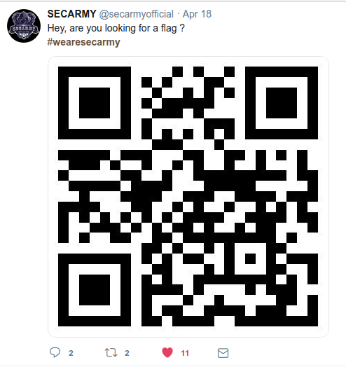
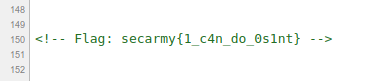

# OSINT begins
**Category:** OSINT  
**Point:** 200

> #wearesecarmy

---

Kita hanya diberikan clue yang singkat, yaitu hashtag bertuliskan _wearesecarmy_ yang mana ini adalah hashtag dari SECARMY. Karena ini hashtag, maka saya iseng mencoba mencari hashtag **#wearesecarmy** pada Facebook dan Instagram.

Belum lelah mencari pada 2 sosmed besar ini, maka saya coba cari di Twitter dan beruntungnya terdapat 1 post dari akun [@secarmyofficial](https://twitter.com/secarmyofficial) yang mencantumkan hashtag **#wearesecarmy** dan 1 gambar QR. Langsung saja download gambar dan decode menggunakan [tools online](https://online-barcode-reader.inliteresearch.com/).

Isi dari qr menyimpan link menuju https://sec-army.ml/osintbegins/.

Website tersebut memang tidak menampilkan apapun, namun jika kita iihat source-nya (Ctrl+U) maka flag yang kita inginkan berada pada baris bawah.

flag : `secarmy{1_c4n_do_0s1nt}`