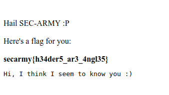

# Validation
**Category:** web  
**Point:** 200

> Can you enroll me for the SECARMY?
> 
> Challenge URL- [Link Here](http://sec-army.ml/validation/validation.php)
> 
> Author: kal1ya

---

Pada challenge ini kita tidak mendapatkan akses ke website jika kita tidak berasal dari situs `https://sec.army`.

Untuk menyelesaikannya kita perlu menambahkan header [Referer](https://en.wikipedia.org/wiki/HTTP_referer) ketika request dengan nilai `https://sec.army`. Untuk melakukannya, saya menggunakan ekstensi [ModHeader](https://chrome.google.com/webstore/detail/modheader/idgpnmonknjnojddfkpgkljpfnnfcklj) dari Chrome.

python exploit : [exploit.py](./exploit.py) 
bash exploit : [exploit.sh](./exploit.sh)

flag : `secarmy{h34der5_ar3_4ngl35}`